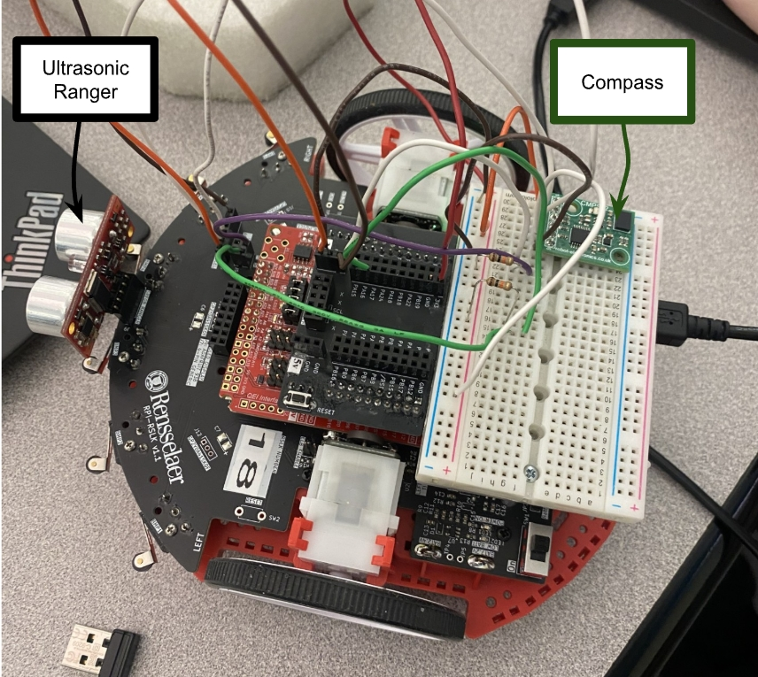
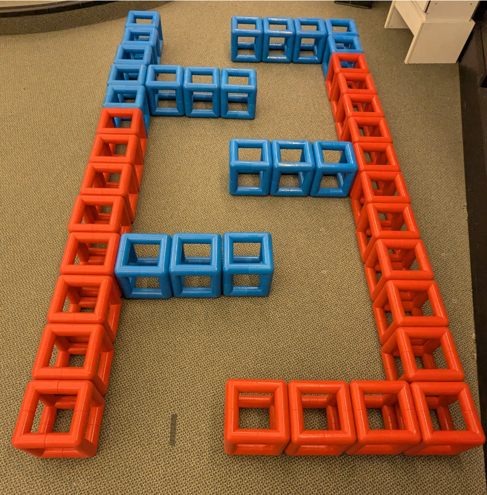
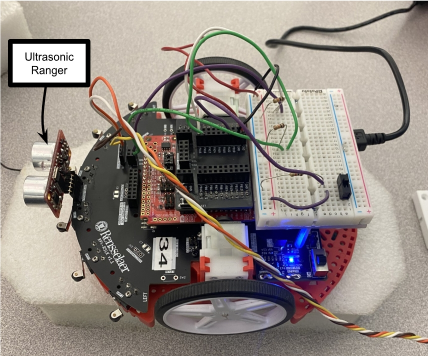

# mspm0-autonomous-rover
Autonomous maze-navigating robot built on the TI MSPM0G3507, with closed-loop PID motor control and gesture-based driving.

  
  

## Table of Contents
[The Problem](#The-Problem)\
[What I Built](#What-I-Built)\
[Control Modes](#Control-Modes)\
[System Design](#System-Design)\
[Hardware & Tools Used](#Hardware-and-Tools-Used)\
[How To Build & Run](#How-To-Build-and-Run)\
[Project Structure](#Project-Structure)\
[Results](#Results)\
[Challenges & What I Learned](#Challenges-and-What-I-Learned)\
[References](#References)\
[About Me](#About-Me)

## The Problem
In order to navigate a block maze environment without a pre-programmed route, an RPI-RSLK car is required to make real time decisions through the use of a combination of an ultrasonic ranger, an electronic compass, and a TI LP-MSPM0G3507 LaunchPad. The car must detect obstacles, decide which way to turn, and recognize when it's stuck, all without any map or human input.

## What I Built
A robotic car with two operating modes: a manually-driven mode where a hand-held sensor board controls speed and steering through gesture (tilt), and a fully autonomous mode where the car navigates unknown maze environments on its own using ultrasonic sensing, physical bumpers, and a zig-zag wall-following strategy with stuck-corner detection.

## Control Modes
- Pitch --> Speed (shared across manual modes)
- Roll-based Turning (direct differential steering)
- Angle-based Turning (closed-loop heading control via encoders + P controller)
- Autonomous Navigation (ultrasonic + bumper-triggered zig-zag turning, with compass-health fallback and stuck-in-corner 180° recovery)

## System Design

  

The CMPS12 compass and SRF08 ultrasonic ranger share a single I2C bus, with pull-up resistors on SDA/SCL. Six mechanical bumper switches provide a redundant, contact-based backup to ultrasonic obstacle detection. [Insert block diagram: Sensors → MSPM0G3507 → State Machine → PWM → Motors]

## Hardware and Tools Used
- TI LP-MSPM0G3507 LaunchPad
- RPI-RSLK robotic car platform
- CMPS12 electronic compass (I2C)
- SRF08 ultrasonic ranger (I2C)
- 6x mechanical bumper switches
- Wheel encoders (quadrature)

### GPIO Pin Map

  

Language: C\
Toolchain: Code Composer Studio

### Hardware Setup for Gesture Based and Pitch/Roll Based Control
(not pictured is the handheld breadboard that utilizes a compass to control the car)

  

### Hardware Setup for Autonomous Navigation

  

## How To Build and Run
### 1. Install Code Composer Studio (CCS)
Download and run the CCS installer. On the "Select Components" page, check only **MSPM0 Arm® Cortex®-M0+ microcontrollers**.

### 2. Install the MSPM0 SDK
1. Launch CCS.
2. Open **View → Resource Explorer**.
3. In the left pane, expand **Arm®-based microcontrollers → Embedded Software**.
4. Select **MSPM0 SDK - 2.##.##.##** and click **Download and Install** (top right).
5. When prompted, also install **SysConfig** — accept the default selections.

### 3. Import and flash the project
1. Connect the LP-MSPM0G3507 LaunchPad via USB.
2. In CCS, go to **Project → Import CCS Projects** and select this repo's project folder.
3. Build the project (hammer icon) to compile.
4. Flash to the board (bug icon) to load and run.
5. Open a serial terminal (e.g. CCS's built-in console, or PuTTY/TeraTerm) at the baud rate set in the code to view live debug output — this is how you'll see compass bearing, state transitions, and sensor readings while the car runs.

### 4. Switching between modes
- **Gesture / manual control:** flash `[gesture_control.c filename]`, use the physical slide switch on the RSLK to toggle between Roll and Angle steering.
- **Autonomous navigation:** flash `[autonomous_nav.c filename]` instead — no manual input required once running.

## Project Structure

## Results

## Challenges and What I Learned
Talk about challenge regarding the car overturning during autonomous navigation and have to add a stop between each turn to prevent it. 

## References
Add the compass and the ranger datasheet
## About Me
Linkedin:\
Personal Email: jconnel24@gmail.com
Phone Number:
