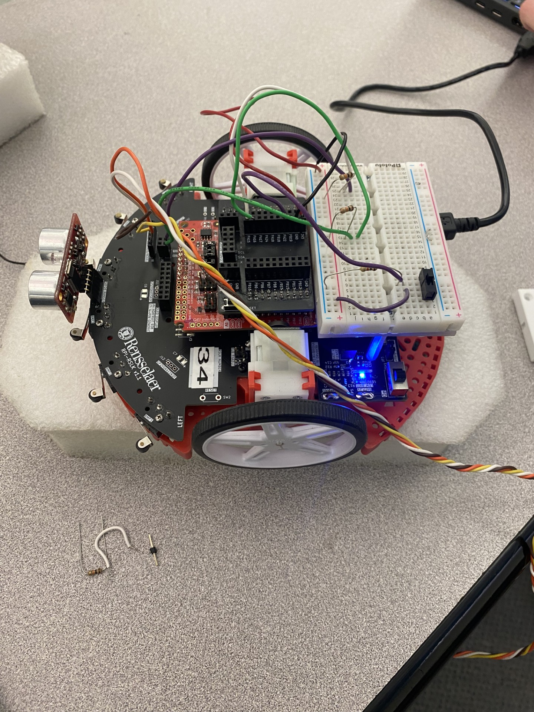
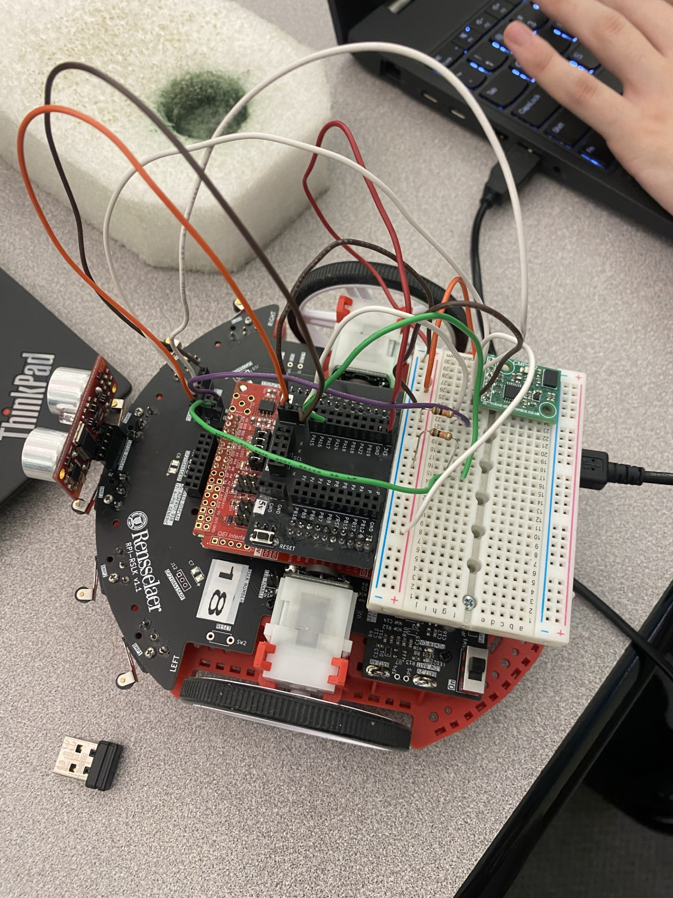

# mspm0-autonomous-rover
Autonomous maze-navigating robot built on the TI MSPM0G3507, with closed-loop PID motor control and gesture-based driving.

# Table of Contents
[Hardware Setup](#Hardware-Setup)\
[The problem](#The-Problem)\
[What I built](#What-I-Built)\
[System design](#System-design)\
[Hardware & tools used](#Hardware-&-Tools-Used)\
[How to build & run](#How-to-Build-&-Run)\
[Project structure](#Project-Structure)\
[Results](#Results)\
[Challenges & what I learned](#Challenges-&-What-I-Learned)\
[References](#References)\
[About me](#About-Me)

# Hardware Setup
### Hardware Setup for Gesture Based and Pitch/Roll Based Control
(not pictured is the handheld breadboard that utilizes a compass to control the car)\

  

### Hardware Setup for Autonomous Navigation

  

# The Problem

# What I Built

# System Design
talk about how we used a block diagram to plan and model the behavior of the car

# Hardware & Tools Used

# How to Build & Run

# Project Structure

# Results

# Challenges & What I Learned

# References

# About Me
Linkedin:\
Email: \
Phone Number:
