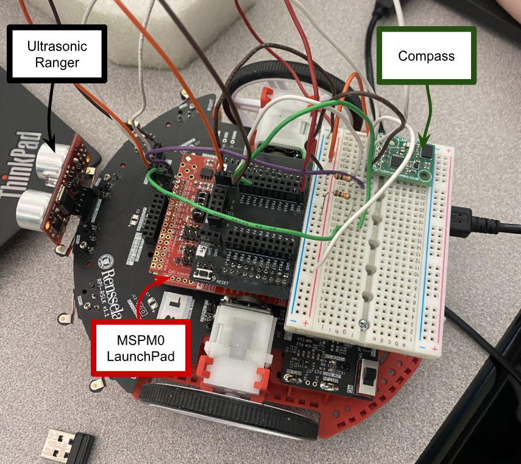
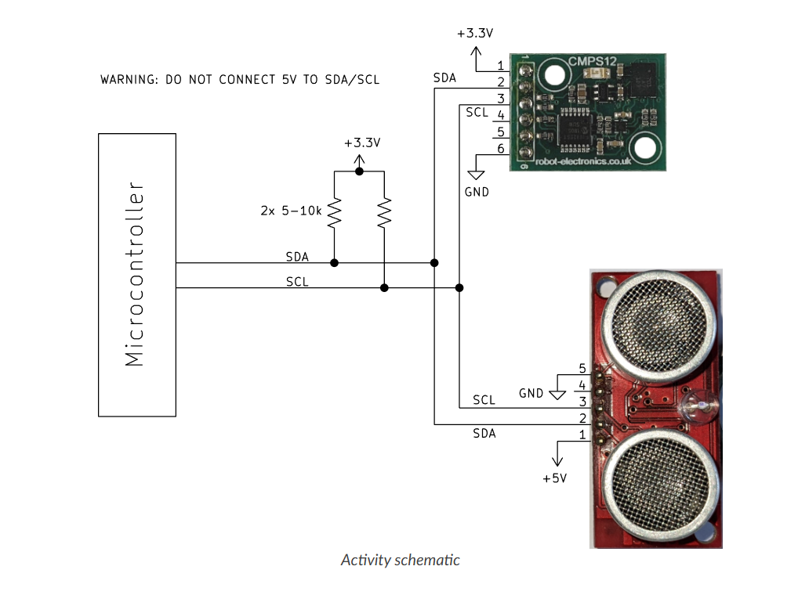
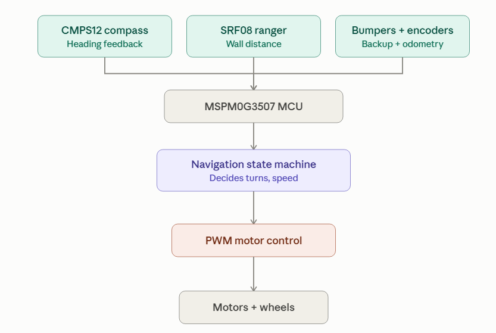
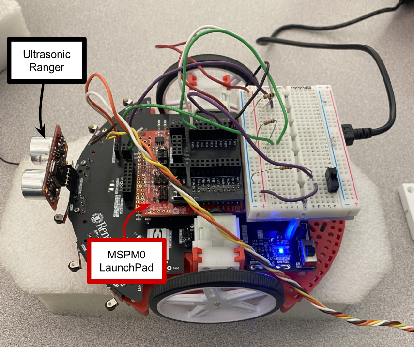

# mspm0-autonomous-rover
Autonomous maze-navigating robot built on the TI MSPM0G3507, with closed-loop PID motor control and gesture-based driving.

<div align="center">
  
  
</div>

## Table of Contents
[The Problem](#the-problem)\
[What I Built](#what-i-built)\
[Control Modes](#control-modes)\
[System Design](#system-design)\
[Hardware & Tools Used](#hardware-and-tools-used)\
[How To Build & Run](#how-to-build-and-run)\
[Project Structure](#project-structure)\
[Results](#results)\
[Challenges & What I Learned](#challenges-and-what-i-learned)\
[References](#references)\
[About Me](#about-me)

## The Problem
In order to navigate a block maze environment without a pre-programmed route, an RPI-RSLK car is required to make real time decisions through the use of a combination of an ultrasonic ranger, an electronic compass, and a TI LP-MSPM0G3507 LaunchPad Development Board. The car must detect obstacles, decide which way to turn, and recognize when it's stuck, all without any map or human input.

## What I Built
A robotic car with two operating modes: a manually-driven mode where a hand-held sensor board controls speed and steering through gesture (tilt), and a fully autonomous mode where the car navigates unknown maze environments on its own using ultrasonic sensing, physical bumpers, and a zig-zag wall-following strategy with stuck-corner detection.

## Control Modes

**Pitch → Speed** (shared across both manual modes)
Tilting the hand-held CMPS12 forward or backward sets the car's forward/backward speed, tilt the front down to speed up, tilt it back to slow down or reverse.

**Roll-based Turning**
In this mode, rolling the hand-held board side to side directly sets a differential speed between the two wheels, causing the car to turn. This is an open-loop control, the turn rate is proportional to how far you roll the board, with no feedback correction.

**Angle-based Turning**
Rather than directly setting a turn rate, rolling the board nudges a target heading. The car then uses its wheel encoders to calculate its actual heading change and applies a proportional (P) controller to steer itself toward that target, closing the loop between commanded and actual heading, rather than reacting to gesture input directly.

A physical slide switch on the RSLK toggles between these two turning modes within `gesture_control/main.c`.

**Autonomous Navigation**
No manual input required. The car drives forward and turns automatically based on ultrasonic and bumper input. See [System Design](#system-design) for the full navigation algorithm.

## System Design
<p align="center">
  
</p>
<p align="center"><em>I2C wiring: CMPS12 compass and SRF08 ranger share a single bus with pull-up resistors on SDA/SCL.</em></p>

<p align="center">
  
</p>
<p align="center"><em>Signal flow: sensor inputs feed the MSPM0G3507, which runs the navigation state machine and drives the motors via PWM.</em></p>

### Autonomous Navigation Algorithm
The car drives forward in a straight line, using the onboard compass to make small heading corrections against drift. While driving, the ultrasonic ranger continuously checks the distance to anything in front of the car:

- If a wall is detected within **18 cm**, the car stops driving forward and turns 90° away from it, alternating left and right each time it encounters a new wall (a zig-zag pattern).
- After completing a turn, the car pauses briefly before resuming forward motion, to let the car fully stop before re-evaluating its surroundings (see Challenges for why this was necessary).
- If the car needs to turn again very soon after its last turn (meaning it hasn't made real forward progress) it's likely boxed into a corner. In this case, instead of another 90° turn, it performs a full 180° turn to reverse course and escape.
- The compass verifies each turn has reached its target heading (within 20°); if the compass becomes unreliable, the car falls back to a fixed-duration turn instead.
- Six mechanical bumper switches serve as a backup obstacle-detection method for cases where the car makes contact with a wall before the ultrasonic sensor can register it, most commonly at sharp corners the sensor doesn't "see" in time.

## Hardware and Tools Used
- TI LP-MSPM0G3507 LaunchPad Development Board
- RPI-RSLK robotic car platform
- CMPS12 electronic compass (I2C)
- SRF08 ultrasonic ranger (I2C)
- 6x mechanical bumper switches
- Wheel encoders (quadrature)

**Language:** C \
**Toolchain:** Code Composer Studio

### GPIO Pin Map
<p align="center">
  
</p>
<p align="center"><em>Source: ENGR-2350 course documentation</em></p>


### About the `engr2350_*` Template Files
This project was built on top of a course-provided template (from RPI's ENGR-2350 embedded systems curriculum) that wraps the MSPM0 SDK's low-level hardware drivers into simplified, easier-to-use functions. Rather than writing directly against TI's driver library, the template exposes higher-level helper functions for common peripherals:

- **`engr2350_gpio`** — digital I/O setup and control (motor direction pins, bumper switches, LEDs)
- **`engr2350_i2c`** — I2C communication used to read from the CMPS12 compass and SRF08 ultrasonic ranger
- **`engr2350_timers`** — timer configuration for PWM generation and encoder event capture
- **`engr2350_analog`** — wraps the MSPM0's ADC12 peripheral for analog voltage reading (voltage reference selection, channel configuration, conversions, and interrupts); used for potentiometer-based control in earlier labs in the course sequence, but not required for this project since control here uses the CMPS12 compass instead
- **`engr2350_mspm0`** — general MSPM0-specific initialization and hardware setup
- **`engr2350_pfmap`** — pin function mapping for the MSPM0G3507

`ti_msp_dl_config.c/h` and `startup_mspm0g350x_ticlang.c` are auto-generated by TI's SysConfig tool and handle low-level chip startup/clock configuration — these aren't hand-written and generally don't need to be modified.

All of the actual project logic — the gesture-based control and autonomous navigation state machines — lives in each project's `main.c`, built using these template functions as building blocks.

### Hardware Setup for Gesture Based and Pitch/Roll Based Control
<p align="center">
  
</p>

This build uses the RSLK's onboard breadboard for supporting circuitry, with the CMPS12 compass itself mounted separately on a hand-held breadboard (not pictured) that the user tilts to control the car. \
#### Visible components:
- **CMPS12 breakout board** — mounted on the RSLK breadboard, connected via I2C to relay compass power/ground to the hand-held unit
- **Pull-up resistors** — on the SDA/SCL lines, visible on the breadboard
- **Mode-select switch** — a 1kΩ resistor wired to a spare, non-conflicting GPIO pin; toggles between Roll-based and Angle-based turning modes
- **QEI interface board** (red) — reads quadrature encoder signals from both wheels
- **LP-MSPM0G3507 LaunchPad** — the black board running the control logic

### Hardware Setup for Autonomous Navigation
<p align="center">
  
</p>

This build adds the SRF08 ultrasonic ranger (front-mounted) for obstacle detection, replacing the hand-held compass setup with the CMPS12 fixed directly onto the car for heading-based steering.\
#### Visible components:
- **SRF08 ultrasonic ranger** — front-facing, silver dual-transducer module
- **CMPS12 compass** — mounted directly on the RSLK chassis (green board, right side)
- **Bumper switches** — around the chassis perimeter, wired as backup obstacle detection

## How To Build and Run
### 1. Install Code Composer Studio (CCS)
Download and run the CCS installer. On the "Select Components" page, check only **MSPM0 Arm® Cortex®-M0+ microcontrollers**.

### 2. Install the MSPM0 SDK
1. Launch CCS.
2. Open **View → Resource Explorer**.
3. In the left pane, expand **Arm®-based microcontrollers → Embedded Software**.
4. Select **MSPM0 SDK - 2.##.##.##** and click **Download and Install** (top right).
5. When prompted, also install **SysConfig** — accept the default selections.

### 3. Import and flash the project
1. Connect the LP-MSPM0G3507 LaunchPad via USB.
2. In CCS, go to **Project → Import CCS Projects**, and select either `autonomous_navigation/` for autonomous maze navigation, or `gesture_control/` for manual gesture-based driving.
3. Build the project (hammer icon) to compile.
4. Flash to the board (bug icon) to load and run.
5. Open a serial terminal (CCS's built-in console, or PuTTY/TeraTerm) to view live debug output — compass bearing, sensor readings, and state transitions print here while the car runs.

## Project Structure

Both `autonomous_navigation/` and `gesture_control/` are self-contained CCS projects built from a shared course-provided template (the `engr2350_*` files), which wraps the MSPM0 SDK's low-level drivers into simpler functions for GPIO, I2C, timers, and analog I/O.

```
├── autonomous_navigation/
│   ├── .ccsproject
│   ├── .cproject
│   ├── .project
│   ├── main.c                        # Zig-zag wall-following state machine
│   ├── .settings/                    # CCS/Eclipse editor preferences
│   ├── inc/
│   │   ├── engr2350_analog.h
│   │   ├── engr2350_gpio.h
│   │   ├── engr2350_i2c.h
│   │   ├── engr2350_mspm0.h
│   │   ├── engr2350_pfmap.h
│   │   ├── engr2350_timers.h
│   │   └── ti_msp_dl_config.h
│   ├── src/
│   │   ├── engr2350_analog.c
│   │   ├── engr2350_gpio.c
│   │   ├── engr2350_i2c.c
│   │   ├── engr2350_mspm0.c
│   │   ├── engr2350_timers.c
│   │   ├── mspm0g3507.cmd
│   │   ├── startup_mspm0g350x_ticlang.c
│   │   └── ti_msp_dl_config.c
│   └── targetConfigs/
│       ├── MSPM0G3507.ccxml
│       └── readme.txt
│
├── gesture_control/
│   ├── .ccsproject
│   ├── .cproject
│   ├── .project
│   ├── main.c                        # Pitch/roll manual driving + angle-based heading control
│   ├── .settings/
│   ├── inc/                          # (same structure as above)
│   ├── src/                          # (same structure as above)
│   └── targetConfigs/
│
├── Images/                           # Diagrams and hardware photos used in this README
└── README.md
```

## Results
This project didn't have a single quantitative benchmark to improve against (no baseline dataset or accuracy target). Success was measured by whether the car could reliably complete the maze without human intervention.

Early on, the car completed the maze successfully only about **1 in 10 attempts**, and only by chance, due to an overturning issue at consecutive walls (see [Challenges](#challenges) for details). After adding a brief pause between turns, the car completed the maze course successfully on every attempt.

## Challenges & What I Learned

**Sensor reliability.** The I2C compass occasionally returned unreliable readings. Rather than trusting it blindly, I added a startup check that verifies the compass values are actually changing, and a fallback to fixed-duration, time-based turns if the compass appears stuck. This way, navigation degrades gracefully instead of failing outright.

**Getting stuck oscillating in corners.** In tight corners, the car would complete a 90° turn only to immediately detect another wall and turn back the other way, repeatedly, without making forward progress. To fix this, I added logic that tracks how much time has passed since the last turn. If the car needs to turn again too soon, it assumes it's stuck in a corner and performs a full 180° turn to reverse out, instead of continuing to alternate small turns that weren't escaping the corner.

**Overturning at consecutive walls.** When the car encountered two walls in quick succession, it would start its second turn before settling from the first, causing an overturn that threw off its heading and made maze completion unreliable (~1 in 10 successful runs). Adding a short pause state between any turn and the next forward movement fixed this, bringing success rate to consistently completing the course every attempt.


## References
- [TI LP-MSPM0G3507 LaunchPad Development Kit](https://www.ti.com/tool/LP-MSPM0G3507) — product page and user's guide
- [CMPS12 Tilt Compensated Compass – Datasheet & Technical Docs](https://www.robot-electronics.co.uk/cmps12-tilt-compensated-magnetic-compass.html) ([PDF](https://www.robot-electronics.co.uk/files/cmps12.pdf))
- [SRF08 Ultrasonic Range Finder – Technical Specification](https://www.robot-electronics.co.uk/htm/srf08tech.html)
  
## About Me
**LinkedIn:** [linkedin.com/in/jenna-connelly](https://www.linkedin.com/in/jenna-connelly-42a4a73a4)
**Email:** [jconnel24@gmail.com](mailto:jconnel24@gmail.com)
